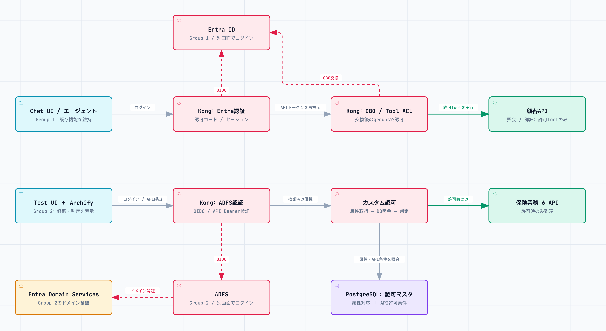

# Kong Gateway: Entra ID OIDC/OBOとADFS/OIDCが共存するハイブリッドIdPデモ

> [!warning] 2026-09-14: 要件更新・開発停止中
> 共通UI/1 DP/6 APIの図はレビュー済み。Entra系4入口・ADFS系3入口（customer共有）、PostgreSQL認可マスタ、別画面ログインは目標構成で、現行アプリ/YAMLは未対応です。まず[最新設計](docs/design-brief.md)と[開発再開パッケージ](docs/development-handoff.md)を確認してください。図のpassはE2E合格ではありません。

[](https://picketfence-labs.github.io/diagrams/5ecfdbb4c0e9/)


[kong-azure-obo-demo](https://github.com/picketfence-labs/kong-azure-obo-demo)をフォークして作成した、**2つの異なる認証経路が共存するデモ環境**です:

- **Group 1**（フォーク元、変更なし）: Chat AIエージェントからMCP経由でバックエンドAPIへアクセスするデモ。「エージェントとしてログインする権限」と「個々のAPI（Tool）を実行する権限」を分離し、Kong Gateway 3.16のOpenID ConnectプラグインのOBO（On-Behalf-Of）機能でトークン交換、AI MCP ProxyのACL機能でTool単位の認可を行う一連の流れを実地検証します
- **Group 2（ADFSグループ、新規）**: Entra IDからフェデレーションしたADFSとOIDCで連携し、レガシーサービス側の認可ロジック（属性からグループ情報を導出しAPIごとのアクセス可否を判定する）をKongのカスタムプラグインとして再現するデモです。旧実装は6 API全てをADFS側へ置いていました。最新要件ではpolicy/claimと共有customerがADFS側、product/simulation/applicationと共有customerがEntra側です

**Konnectは使用しません**（Kong Gateway単体、Postgres backed）。

着手前の基本設計は [docs/design-brief.md](./docs/design-brief.md) を参照してください（Group 1・Group 2それぞれの要件・アーキテクチャを記載）。個別の設計判断（検討した選択肢・判断基準）は、今後 [docs/decisions/](./docs/decisions/) にADRとして記録していきます。**Group 2はSAML方式からOIDC方式への転換を経ており、経緯は [docs/design-brief.md](./docs/design-brief.md) のGroup 2冒頭「方針転換の経緯」を参照してください**。


**実際に動かして動作確認したい方は [TESTING.md](./TESTING.md) を参照してください**（スクリーンショット付きの検証手順。Group 1はfork元の検証記録を継承、本repoの新要件E2Eは未実施）。**OBO（On-Behalf-Of）によるトークン交換の仕組みを図解付きで理解したい方は [docs/OBO.md](./docs/OBO.md) を参照してください**。Group 2のUI（insurance-ui）のセットアップ手順は下記「Group 2専用UI（insurance-ui）」に追記済みです。ADFS実インフラ構築後のKong側`deck sync`手順は別途追記します。

## 全体アーキテクチャ

### Group 1（フォーク元、変更なし）
Kong Gatewayが3系統のRoute/Serviceをフロントします（詳細は [docs/design-brief.md](./docs/design-brief.md) 参照）:

1. **Chat UI/エージェント アクセス用Route**: `openid-connect`（認可コードフロー、ログイン可否判定のみ。OBOなし）
2. **MCPエンドポイント用Route**: `openid-connect`（`token_exchange` でOBO）＋ `ai-mcp-proxy`（ACL）
3. **LLM（Azure OpenAI）アクセス用Route**: `ai-proxy-advanced`（LLMアクセスの抽象化）

Chat UI（Next.js）はKongの認証を全面的に信頼し、独自のOAuthクライアント実装（Auth.js等）を持ちません。

### Group 2（以下3項目は旧実装の説明）

最新の認可マスタと経路分担はDesign Briefを正とします。

1. **IdP接続**: `openid-connect`プラグインがADFSのOIDCエンドポイント（Entra IDからフェデレーション）に対し認可コードフローを実施（OBOなし）
2. **認可ロジック**: カスタムLuaプラグインがIDトークンのクレームからグループを確定し、Service単位の許可リストと照合してアクセス可否を判定
3. **バックエンド**: `kong-api-bundle-insurance`のGHCR公開コンテナ6種

詳細は [docs/design-brief.md](./docs/design-brief.md) の「Group 2」節を参照してください。

## 必要なもの

### Group 1
- Docker / Docker Compose
- Kong Enterpriseライセンス
- Terraform >= 1.5（`azuread` provider）
- Microsoft Entra IDテナントと管理者権限（App Registration・Security Group作成のため）
- Azure OpenAIリソース

### Group 2（追加）
- picketfence自身のAzureサブスクリプション＋Entra IDテナントへの管理者アクセス（Microsoft Entra Domain Services・ADFS VM作成のため）
- ADFSサーバー用Windows Server VMを稼働させ続けられるAzure予算（デモ後は`terraform destroy`で削除する前提）

## 技術スタック
- **Kong Gateway**: `kong/kong-gateway-dev:pr-21082-ubuntu`（ベータ、Entra ID OBO対応ビルド）、Postgres backed、decKで宣言的管理
- **Entra ID連携**: Terraform（`azuread` provider）
- **Chat UI/エージェント**: Next.js（App Router）+ Vercel AI SDK
- **デモAPI（Customer Inquiry/Customer Details）**: TypeScript + Bun
- **実LLM**: Azure OpenAI（`ai-proxy-advanced`経由で抽象化）

## デモAPI（Customer Inquiry/Customer Details）

`services/demo-api`（Bun/TypeScript）が、design-brief 2節のAPI仕様をひとつのHTTPサーバーとして実装しています。

### エンドポイント
| メソッド/パス | 相当するAPI | 検索条件 | 戻り値 |
|---|---|---|---|
| `GET /customers?name=&gender=&prefecture=` | Customer Inquiry | 氏名（部分一致）/性別/都道府県、AND条件（全て省略可） | `id`/`name`/`gender`/`prefecture`の4項目のみ |
| `GET /customers/:id` | Customer Details | 顧客ID（UUID）による完全一致のみ | フル項目（下記参照）。一覧・部分一致検索のエンドポイントは存在しないため、Customer Inquiryを経由しないとID自体を取得できない |

テストデータの生成タイミングと構造（生成される具体的なフィールド・サンプル）は [TESTING.md](./TESTING.md) を参照してください。

### ローカル起動
```bash
cd services/demo-api
bun run dev   # PORT環境変数で変更可（デフォルト3001）
bun test      # ユニットテスト（検索AND条件・ID一意取得等）
```

## セットアップ手順

### Azure/Entra ID 認証（Terraformを実行する前に一度だけ）
Terraform（`terraform/`配下）は、クライアントシークレット等の静的資格情報を持たず、Azure CLIの委譲認証に委ねる。

1. Azure CLIをインストール: `brew install azure-cli`
2. ログイン: `az login`（ブラウザが開くのでAzureアカウントでサインインする）
3. 対象テナント/サブスクリプションを確認: `az account show --output table`
   - 複数サブスクリプションがある場合は `az account set --subscription <id>` で切り替える
4. 疎通確認: `cd terraform && terraform init && terraform plan`
   - `auth_check` outputに想定通りのテナントID/サブスクリプションIDが出れば成功（この段階ではリソースは何も作成されない）

`terraform/apps.tf`は既存Chat用callbackに加えて`/entra/auth/callback`をmiddle-tier Appへ登録し、保険デモのstatus Routeで使うSecurity Group claimを有効にします。別のOAuthクライアントは作成しません。

### Kong Gateway（decK宣言的設定）
`kong/`配下がRoute別のdecK state file（`login-route.yaml`: Chat UIログイン、`mcp-route.yaml`: OBO+ACL、`llm-route.yaml`: Azure OpenAI抽象化）。秘匿値は平文で書かず、decKの環境変数テンプレート`${{ env "DECK_XXX" }}`（`DECK_`プレフィックス必須）で参照する。

1. Docker Composeを起動: `cp .env.example .env` を編集の上 `docker compose up -d`（Kong Enterpriseライセンスが必要）
2. Terraform outputから必要な値を環境変数へ展開:
   ```bash
   cd terraform
   export DECK_ENTRA_ISSUER="https://login.microsoftonline.com/$(terraform output -raw entra_tenant_id)/v2.0"
   export DECK_MIDDLE_TIER_CLIENT_ID=$(terraform output -raw middle_tier_client_id)
   export DECK_MIDDLE_TIER_CLIENT_SECRET=$(terraform output -raw middle_tier_client_secret)
   export DECK_DOWNSTREAM_API_APPLICATION_ID_URI=$(terraform output -raw downstream_api_application_id_uri)
   export DECK_GROUP_API_CUSTOMER_INQUIRY_OBJECT_ID=$(terraform output -raw group_api_customer_inquiry_object_id)
   export DECK_GROUP_API_CUSTOMER_DETAILS_OBJECT_ID=$(terraform output -raw group_api_customer_details_object_id)
   export DECK_AZURE_OPENAI_API_KEY=$(terraform output -raw azure_openai_api_key)
   export DECK_AZURE_OPENAI_DEPLOYMENT_NAME=$(terraform output -raw azure_openai_deployment_name)
   export DECK_AZURE_OPENAI_INSTANCE_NAME=kong-obo-demo-openai
   # Kongのセッションcookie署名用シークレット（decK専用の値、Terraform outputではない）。
   # 再syncのたびに値を変えると既存セッションが無効化されるため、.env等に一度保存して使い回すこと
   export DECK_SESSION_SECRET=$(openssl rand -base64 32)
   cd ..
   ```
3. ローカルでの構文・スキーマ検証（Kongへの接続不要）: `deck file validate kong/login-route.yaml kong/mcp-route.yaml kong/llm-route.yaml`
4. 実際のKongへ反映: `deck gateway sync kong/login-route.yaml kong/mcp-route.yaml kong/llm-route.yaml`

MCP/LLM Routeは、Docker Composeの内部専用ネットワーク（`kong-internal`、`internal: true`）配下に置くことでブラウザから到達不可にしている（詳細は[docs/OBO.md](./docs/OBO.md)の全体構成図を参照）。

### Chat UI/エージェント

`services/chat-ui`（Next.js App Router + Vercel AI SDK）。design-brief 3節の通り、Auth.js等のOAuthクライアント実装は持たず、`kong/login-route.yaml`のopenid-connectプラグインが認可コードフロー・セッション管理・ログアウトを全て担う。Next.js側はKongが`upstream_headers`/`upstream_access_token_header`で転送するヘッダーを信頼するだけ:

- `X-User-Name`/`X-User-Email`: ログイン中ユーザーの表示用（画面上部のヘッダーバー）
- `Authorization: Bearer <access_token>`: Route 1のログインで取得したアクセストークン（audienceはミドル層App自身）。`src/app/api/chat/route.ts`がこれをそのままMCPエンドポイント用Route（`kong/mcp-route.yaml`）へのBearerトークンとして再提示し、そちらのOBO(`token_exchange.grant_type=jwt_bearer`)のassertionとして使われる

LLM呼び出しは`kong/llm-route.yaml`の`ai-proxy-advanced`（Route `/llm`）を、Azure固有の設定を一切持たないOpenAI互換クライアントとして叩く。`model`には固定値`kong-demo-llm`（`llm-route.yaml`の`model_alias`と一致）を送るだけで、実際のAzureデプロイ名・APIバージョン・エンドポイントはエージェント側から完全に隠蔽される（design-brief 検証方法9番目の要件）。

ローカル起動（Docker Composeを使わない場合）:
```bash
cd services/chat-ui
bun install
bun run dev   # http://localhost:3000 単体では認証ヘッダーが無いため、Kong経由（http://localhost:8000）でのアクセスが前提
```

### 共通保険デモUIのG1/G2 PoC

`services/insurance-ui`（Next.js App Router）は、未認証でも表示できる`/insurance/`のshellからEntra IDとADFSを別画面で認証します。アプリ自身はOAuthクライアントを持ちません。`kong/insurance-ui-route.yaml`のOpenID Connect pluginが、IdPごとに分離した認可コードフローとsessionを処理します。

- Entra ID: `/entra/auth/start`、`/entra/auth/callback`、`/entra/auth/status`、`/entra/auth/logout`
- ADFS: `/adfs/auth/start`、`/adfs/auth/callback`、`/adfs/auth/status`、`/adfs/auth/logout`
- G2 probe: `/adfs/auth/probe`で、検証済みscalar属性を既存`legacy-authz-adapter`へ渡す
- Cookie: `insurance_entra_session`は`/entra`、`insurance_adfs_session`は`/adfs`に限定する
- status応答: 認証済みか、OpenID Connect pluginが転送した検証済み属性が存在するかだけを返す

認証完了ページはcodeやtokenを親画面へ渡しません。親画面へ再確認を通知し、親画面が対応するstatus Routeを呼びます。旧`api/access-check`のBearer token relayは削除しました。API認可、PostgreSQLマスタ、実行履歴、図連動は後続gateの対象です。

Kong上で`kong/login-route.yaml`（`/`）と共存させるため、UIは`/insurance`配下にマウントします（`services/insurance-ui/next.config.ts`の`basePath`、`kong/insurance-ui-route.yaml`の`strip_path: false`）。

ローカル起動（Docker Composeを使わない場合）:
```bash
cd services/insurance-ui
bun install
bun run dev   # http://localhost:3000 単体では認証ヘッダーが無いため、Kong経由（http://localhost:8000/insurance/）でのアクセスが前提
```

Kong側への反映はまだ行っていません。P1の実機検証では、Entra ID用の`DECK_ENTRA_ISSUER`、`DECK_MIDDLE_TIER_CLIENT_ID`、`DECK_MIDDLE_TIER_CLIENT_SECRET`、`DECK_ENTRA_INSURANCE_SESSION_SECRET`と、ADFS用の`DECK_ADFS_ISSUER`、`DECK_ADFS_CLIENT_ID`、`DECK_ADFS_CLIENT_SECRET`、`DECK_ADFS_GROUP_CLAIM_NAME`、`DECK_ADFS_SESSION_SECRET`、`DECK_ADFS_POC_ATTRIBUTE_VALUE`を用意します。session secretはTerraform outputに含めず、IdP間で共有しません。`DECK_ADFS_POC_ATTRIBUTE_VALUE`はG2 probe専用で、後続の認可DBを代替しません。

### ADFS/Entra Domain Servicesインフラ（旧構成の参考）

> 新しいcallback、claim、API資源の登録と承認gateは[改訂runbook](docs/adfs-setup-runbook.md)を正とします。

`terraform/adfs_*.tf`（ネットワーク・Microsoft Entra Domain Services・ADFS VM）・`terraform/insurance_*.tf`（5グループのEntra IDテストユーザー）が、design-brief Group2「3. アーキテクチャ」のADFS/Entra側インフラを担う。ADFSロールのインストール・ファーム構築・OAuthサーバー設定（Application Group/Relying Party登録、Claim Issuance Policy）はTerraformの管理範囲外とし、[docs/adfs-setup-runbook.md](./docs/adfs-setup-runbook.md)に従って手動で行う（自動化度合いの判断根拠は[docs/decisions/0001-adfs-vm-provisioning-automation.md](./docs/decisions/0001-adfs-vm-provisioning-automation.md)参照）。

**このインフラはKong社自身のEntra IDテナント（`kongstrong.onmicrosoft.com`、Group 1が使う既定のTerraformプロバイダ）とは別の、picketfence自身のAzureサブスクリプション・Entra IDテナントに構築する**（`terraform/adfs_providers.tf`のプロバイダエイリアス`azurerm.picketfence`/`azuread.picketfence`）。**Microsoft Entra Domain Services・ADFSサーバー用VMは稼働中は継続コストが発生する**（CLAUDE.mdエスカレーション条件2番目。デモ終了後は`terraform destroy`で削除する前提）。

1. picketfence自身のアカウントでAzure CLIへ追加ログイン: `az login`（`kongstrong.onmicrosoft.com`用のログインとは別に、picketfence側アカウントでも実行する。Azure CLIは複数アカウントのトークンを同時にキャッシュできるため、`az account set`でアクティブ切り替えする必要はない）
2. 変数ファイルを準備:
   ```bash
   cd terraform
   cp adfs.tfvars.example adfs.tfvars
   # picketfence_azure_subscription_id / picketfence_azure_tenant_id / nsg_allowed_source_cidr等を編集
   ```
3. 構文・スキーマ検証（Azureへの接続不要）: `terraform validate`
4. 差分確認: `terraform plan -var-file=adfs.tfvars`
5. **`terraform apply`はCLAUDE.mdのエスカレーション条件に該当するため、実行前に必ず確認を取ること**
6. `apply`後、[docs/adfs-setup-runbook.md](./docs/adfs-setup-runbook.md)の手順でADFSロール・ファーム構築・OAuthサーバー設定を行う
7. `terraform output`から得られる値をKong側のdecK同期に使う（runbook 9節参照）

## 知見の記録
- 設計判断（選択肢・判断基準・想定と実際の差分）: [docs/decisions/](./docs/decisions/)（1判断＝1ファイル、`TEMPLATE.md`参照）
- 想定通りに動かなかったこと（漏れなく記録）: [docs/troubleshooting-log.md](./docs/troubleshooting-log.md)

## クリーンアップ

> 以下の旧手順を新要件で無条件に実行しないでください。対象資源を明示し、既存Group 1資源を除外し、利用者承認と[改訂runbook](docs/adfs-setup-runbook.md)の残存確認に従ってください。
```bash
docker compose down -v
terraform destroy
```
