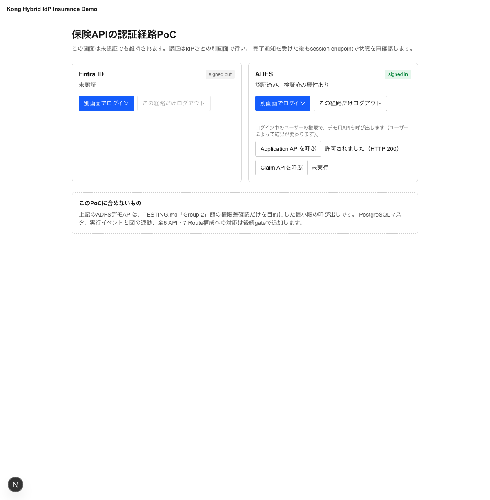
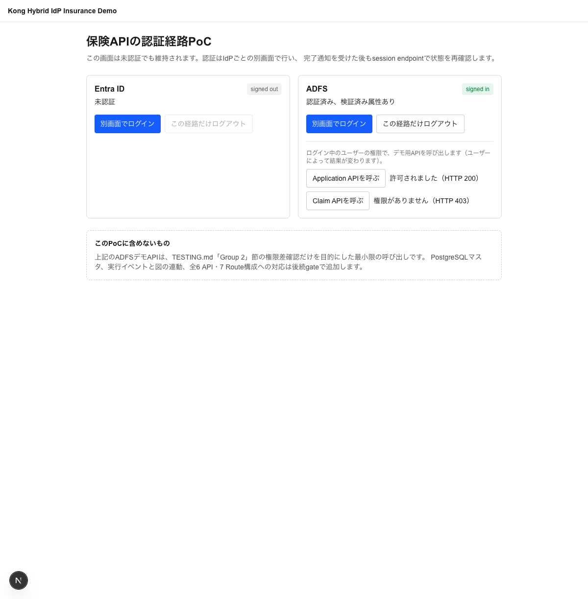

# Kong Gateway: Entra ID OIDC/OBOとADFS/OIDCが共存するハイブリッドIdPデモ

> [!warning] 2026-09-17: 現行実装と将来要件（P4）の区別
> 現在動いているのは、Group 1（Entra ID、フォーク元のまま）と、Group 2の**旧ADFS専用構成**（保険6 APIすべてをADFSのbearerトークン＋カスタムプラグインで保護し、認可はKong宣言的設定`allowed_groups`で判定する構成）です。いずれも実機で動作確認済みです（下記スクリーンショット・[TESTING.md](./TESTING.md)参照）。一方、Entra系4入口・ADFS系3入口（customer共有）・PostgreSQL認可マスタという将来要件（P4、[docs/design-brief.md](./docs/design-brief.md)・[docs/development-handoff.md](./docs/development-handoff.md)参照）はレビュー済みの設計であり、**まだ実装していません**。以下の説明・図・セットアップ手順は現行実装を対象とします。将来要件との対応は各節の注記を参照してください。

[](https://picketfence-labs.github.io/diagrams/5ecfdbb4c0e9/)

[kong-azure-obo-demo](https://github.com/picketfence-labs/kong-azure-obo-demo)をフォークして作成した、**2つの異なる認証経路が共存するデモ環境**です:

- **Group 1**（フォーク元、変更なし）: Chat AIエージェントからMCP経由でバックエンドAPIへアクセスするデモ。「エージェントとしてログインする権限」と「個々のAPI（Tool）を実行する権限」を分離し、Kong Gateway 3.16のOpenID ConnectプラグインのOBO（On-Behalf-Of）機能でトークン交換、AI MCP ProxyのACL機能でTool単位の認可を行う一連の流れを実地検証します
- **Group 2（ADFSグループ、新規）**: Entra IDからフェデレーションした自己管理AD DSフォレスト＋ADFSとOIDCで連携し、レガシーサービス側の認可ロジック（属性からグループ情報を導出しAPIごとのアクセス可否を判定する）をKongのカスタムプラグインとして再現するデモです

着手前の基本設計は [docs/design-brief.md](./docs/design-brief.md) を参照してください（Group 1・Group 2それぞれの要件・アーキテクチャを記載）。個別の設計判断（検討した選択肢・判断基準）は [docs/decisions/](./docs/decisions/) にADRとして記録しています。**Group 2はSAML方式からOIDC方式への転換を経ており、経緯は [docs/design-brief.md](./docs/design-brief.md) のGroup 2冒頭「方針転換の経緯」を参照してください**。

**実際に動かして動作確認したい方は [TESTING.md](./TESTING.md) を参照してください**（スクリーンショット付きの検証手順、Group 1・Group 2両方）。仕組みを図解付きで理解したい方は、Group 1は [docs/OBO.md](./docs/OBO.md)（OBOトークン交換）、Group 2は [docs/Custom-Plugin.md](./docs/Custom-Plugin.md)（ADFS OIDC認証・カスタムプラグイン認可）を参照してください。

## 全体アーキテクチャ

共通のKong Gateway（Postgres backed、decKで宣言的管理）1系統が、性質の異なる2グループの通信を1 data planeでフロントします。両グループはRoute/Service/Pluginの設定を通じて独立しており、互いのIdP・セッション・認可ロジックには影響しません。

## Group 1: Entra ID 認証・認可（Chat UI / OIDC OBO）

### 概要

Chat UI（Next.js + Vercel AI SDK）から、Kongが仲介するOIDC OBO（On-Behalf-Of）トークン交換を経て、AI MCP ProxyのACLで保護されたバックエンドAPI（Customer Inquiry / Customer Details）へアクセスします。詳しい仕組みは [docs/OBO.md](./docs/OBO.md) を参照してください。

### アーキテクチャ

Kong Gatewayが3系統のRoute/Serviceをフロントします（詳細は [docs/design-brief.md](./docs/design-brief.md) 参照）:

1. **Chat UI/エージェント アクセス用Route**: `openid-connect`（認可コードフロー、ログイン可否判定のみ。OBOなし）
2. **MCPエンドポイント用Route**: `openid-connect`（`token_exchange` でOBO）＋ `ai-mcp-proxy`（ACL）
3. **LLM（Azure OpenAI）アクセス用Route**: `ai-proxy-advanced`（LLMアクセスの抽象化）

Chat UI（Next.js）はKongの認証を全面的に信頼し、独自のOAuthクライアント実装（Auth.js等）を持ちません。MCP/LLM Routeは、Docker Composeの内部専用ネットワーク（`kong-internal`、`internal: true`）配下に置くことでブラウザから到達不可にしています。

### 技術スタック
- **Kong Gateway**: `kong/kong-gateway-dev:pr-21082-ubuntu`（ベータ、Entra ID OBO対応ビルド）、Postgres backed、decKで宣言的管理
- **Entra ID連携**: Terraform（`azuread` provider）
- **Chat UI/エージェント**: Next.js（App Router）+ Vercel AI SDK
- **デモAPI（Customer Inquiry/Customer Details）**: TypeScript + Bun
- **実LLM**: Azure OpenAI（`ai-proxy-advanced`経由で抽象化）

### スクリーンショット

Entra IDでログインし、ユーザーによってChat UIから取得できる情報の範囲が変わることを確認した実行結果です（詳細な手順は [TESTING.md](./TESTING.md) 参照）。

| Entra IDログイン画面 | Inquiryのみユーザー: 検索は成功、詳細は取得不可 | 両方権限ユーザー: 詳細情報まで取得できる |
|---|---|---|
|  |  |  |

### デモAPI（Customer Inquiry/Customer Details）

`services/demo-api`（Bun/TypeScript）が、design-brief 2節のAPI仕様をひとつのHTTPサーバーとして実装しています。

#### エンドポイント
| メソッド/パス | 相当するAPI | 検索条件 | 戻り値 |
|---|---|---|---|
| `GET /customers?name=&gender=&prefecture=` | Customer Inquiry | 氏名（部分一致）/性別/都道府県、AND条件（全て省略可） | `id`/`name`/`gender`/`prefecture`の4項目のみ |
| `GET /customers/:id` | Customer Details | 顧客ID（UUID）による完全一致のみ | フル項目（下記参照）。一覧・部分一致検索のエンドポイントは存在しないため、Customer Inquiryを経由しないとID自体を取得できない |

テストデータの生成タイミングと構造（生成される具体的なフィールド・サンプル）は [TESTING.md](./TESTING.md) を参照してください。

#### ローカル起動
```bash
cd services/demo-api
bun run dev   # PORT環境変数で変更可（デフォルト3001）
bun test      # ユニットテスト（検索AND条件・ID一意取得等）
```

### セットアップ手順（Group 1）

#### 1. Azure/Entra ID 認証（Terraformを実行する前に一度だけ）
Terraform（`terraform/`配下）は、クライアントシークレット等の静的資格情報を持たず、Azure CLIの委譲認証に委ねます。

1. Azure CLIをインストール: `brew install azure-cli`
2. ログイン: `az login`（ブラウザが開くのでAzureアカウントでサインインする）
3. 対象テナント/サブスクリプションを確認: `az account show --output table`
   - 複数サブスクリプションがある場合は `az account set --subscription <id>` で切り替える
4. 疎通確認: `cd terraform && terraform init && terraform plan`
   - `auth_check` outputに想定通りのテナントID/サブスクリプションIDが出れば成功（この段階ではリソースは何も作成されない）

`terraform/apps.tf`は既存Chat用callbackに加えて`/entra/auth/callback`をミドル層Appへ登録し、保険デモのstatus Routeで使うSecurity Group claimを有効にします。別のOAuthクライアントは作成しません。

#### 2. Kong Gateway（decK宣言的設定）
`kong/`配下がRoute別のdecK state file（`login-route.yaml`: Chat UIログイン、`mcp-route.yaml`: OBO+ACL、`llm-route.yaml`: Azure OpenAI抽象化）です。秘匿値は平文で書かず、decKの環境変数テンプレート`${{ env "DECK_XXX" }}`（`DECK_`プレフィックス必須）で参照します。

1. Docker Composeを起動: `cp .env.example .env` を編集の上 `docker compose up -d`（Kong Enterpriseライセンスが必要）
2. Terraform outputから必要な値を環境変数へ展開:
   ```bash
   cd terraform
   export DECK_ENTRA_ISSUER="https://login.microsoftonline.com/$(terraform output -raw entra_tenant_id)/v2.0"
   export DECK_MIDDLE_TIER_CLIENT_ID=$(terraform output -raw middle_tier_client_id)
   export DECK_MIDDLE_TIER_CLIENT_SECRET=$(terraform output -raw middle_tier_client_secret)
   export DECK_DOWNSTREAM_API_APPLICATION_ID_URI=$(terraform output -raw downstream_api_application_id_uri)
   export DECK_GROUP_API_CUSTOMER_INQUIRY_OBJECT_ID=$(terraform output -raw group_api_customer_inquiry_object_id)
   export DECK_GROUP_API_CUSTOMER_DETAILS_OBJECT_ID=$(terraform output -raw group_api_customer_details_object_id)
   export DECK_AZURE_OPENAI_API_KEY=$(terraform output -raw azure_openai_api_key)
   export DECK_AZURE_OPENAI_DEPLOYMENT_NAME=$(terraform output -raw azure_openai_deployment_name)
   export DECK_AZURE_OPENAI_INSTANCE_NAME=kong-obo-demo-openai
   # Kongのセッションcookie署名用シークレット（decK専用の値、Terraform outputではない）。
   # 再syncのたびに値を変えると既存セッションが無効化されるため、.env等に一度保存して使い回すこと
   export DECK_SESSION_SECRET=$(openssl rand -base64 32)
   cd ..
   ```
3. ローカルでの構文・スキーマ検証（Kongへの接続不要）: `deck file validate kong/login-route.yaml kong/mcp-route.yaml kong/llm-route.yaml`
4. 実際のKongへ反映: `deck gateway sync kong/login-route.yaml kong/mcp-route.yaml kong/llm-route.yaml`

#### 3. Chat UI/エージェント

`services/chat-ui`（Next.js App Router + Vercel AI SDK）。design-brief 3節の通り、Auth.js等のOAuthクライアント実装は持たず、`kong/login-route.yaml`のopenid-connectプラグインが認可コードフロー・セッション管理・ログアウトを全て担います。Next.js側はKongが`upstream_headers`/`upstream_access_token_header`で転送するヘッダーを信頼するだけです:

- `X-User-Name`/`X-User-Email`: ログイン中ユーザーの表示用（画面上部のヘッダーバー）
- `Authorization: Bearer <access_token>`: Route 1のログインで取得したアクセストークン（audienceはミドル層App自身）。`src/app/api/chat/route.ts`がこれをそのままMCPエンドポイント用Route（`kong/mcp-route.yaml`）へのBearerトークンとして再提示し、そちらのOBO(`token_exchange.grant_type=jwt_bearer`)のassertionとして使われます

LLM呼び出しは`kong/llm-route.yaml`の`ai-proxy-advanced`（Route `/llm`）を、Azure固有の設定を一切持たないOpenAI互換クライアントとして叩きます。`model`には固定値`kong-demo-llm`（`llm-route.yaml`の`model_alias`と一致）を送るだけで、実際のAzureデプロイ名・APIバージョン・エンドポイントはエージェント側から完全に隠蔽されます（design-brief 検証方法9番目の要件）。

ローカル起動（Docker Composeを使わない場合）:
```bash
cd services/chat-ui
bun install
bun run dev   # http://localhost:3000 単体では認証ヘッダーが無いため、Kong経由（http://localhost:8000）でのアクセスが前提
```

## Group 2: AD DS/ADFS 認証・カスタムプラグイン認可（Insurance UI）

### 概要

自己管理AD DSフォレスト上のADFSに対しOIDC認可コードフローで認証し、認証済みIDトークンのクレーム（`department`属性由来の値）からカスタムLuaプラグイン`legacy-authz-adapter`（[kong/plugins/legacy-authz-adapter/](./kong/plugins/legacy-authz-adapter/)）がグループを確定、Service（API）単位の許可リストと照合してアクセス可否を判定します。詳しい仕組みは [docs/Custom-Plugin.md](./docs/Custom-Plugin.md) を参照してください。

### アーキテクチャ

現行実装は、保険6 API（`product`/`application`/`claim`/`policy`/`simulation`/`customer`）全てをADFS側の無接頭辞Route（`/product`等）で保護する構成です:

1. **IdP接続**: `openid-connect`プラグインがADFSのOIDCエンドポイント（Entra IDからフェデレーション）に対し認可コードフローを実施（OBOなし）
2. **認可ロジック**: カスタムLuaプラグイン`legacy-authz-adapter`がIDトークンのクレームからグループを確定し、Service単位の許可リスト（`allowed_groups`）と照合してアクセス可否を判定
3. **バックエンド**: `kong-api-bundle-insurance`のGHCR公開コンテナ6種（新規実装なし、そのままpull）

insurance-ui（`services/insurance-ui`）は、未認証でも表示できる`/insurance/`のshellからEntra IDとADFSを別画面で認証する共通UIです。アプリ自身はOAuthクライアントを持たず、`kong/insurance-ui-route.yaml`のOpenID Connectプラグインが、IdPごとに分離した認可コードフローとsessionを処理します:

- ADFS: `/adfs/auth/start`、`/adfs/auth/callback`、`/adfs/auth/status`、`/adfs/auth/logout`
- Cookie: `insurance_adfs_session`は`/adfs`パスに限定
- ADFSログイン後、insurance-uiには「Application API」「Claim API」の2つのデモボタンが表示されます。ブラウザの既存ADFSセッションCookieをそのまま使い（別途bearerトークンを取得する操作は無し）、`/adfs/call/application`・`/adfs/call/claim`という専用Route（`kong/insurance-application.yaml`・`kong/insurance-claim.yaml`に追加。認可判定は本来のbearer用Routeと同一の`allowed_groups`）を叩いて、ログイン中ユーザーの権限次第で結果（許可/拒否）が変わることをその場で確認できます

詳細は [docs/design-brief.md](./docs/design-brief.md) の「Group 2」節、将来要件（Entra 4入口・ADFS 3入口・PostgreSQL認可マスタ、P4）との対応は [docs/Custom-Plugin.md](./docs/Custom-Plugin.md) を参照してください。

### 技術スタック
- **IdP**: 自己管理AD DSフォレスト（Windows Server、Azure VM上に新規構築）＋ADFS（Entra IDからフェデレーション）
- **Kong Gateway**: Group 1と共通の1 data plane。`openid-connect`（OIDC認可コードフロー）＋カスタムLuaプラグイン`legacy-authz-adapter`
- **バックエンド6 API**: `kong-api-bundle-insurance`のGHCR公開コンテナ（`product`/`customer`/`simulation`/`application`/`policy`/`claim`）
- **Insurance UI**: Next.js（App Router）、`services/insurance-ui`
- **インフラのIaC**: Terraform（`azurerm`/`azuread` provider、picketfence自身のAzureサブスクリプション）＋対話的runbook（ADFSロール・ファーム構築）

### スクリーンショット

同じユーザーでもAPIによって、また同じAPIでもユーザーによって、結果（許可/拒否）が変わることをinsurance-uiのボタン操作で確認した実行結果です（6ケース全結果は [TESTING.md](./TESTING.md) 参照）。

| Insurance UI（ADFSでログイン後） | sales: Application APIは許可 | sales: Claim APIは拒否 |
|---|---|---|
| ADFSで`demo-sales@adfsdemo.picketfencelabs.local`としてログイン、Application/Claim APIボタンを実行 |  |  |

### バックエンドAPI（保険6 API）

`kong-api-bundle-insurance`（別リポジトリ）がGHCRで公開しているコンテナイメージ6種（`product`/`customer`/`simulation`/`application`/`policy`/`claim`）を、`docker-compose.yml`から`kong-internal`ネットワーク経由でそのままpull・接続しています。本リポジトリ側でのAPI実装は行っていません。

### セットアップ手順（Group 2）

#### 1. picketfence自身のAzure認証
このインフラはKong社自身のEntra IDテナント（`kongstrong.onmicrosoft.com`、Group 1が使う既定のTerraformプロバイダ）とは別の、picketfence自身のAzureサブスクリプションに構築します（`terraform/adfs_providers.tf`のプロバイダエイリアス`azurerm.picketfence`/`azuread.picketfence`）。

1. picketfence自身のアカウントでAzure CLIへ追加ログイン: `az login`（`kongstrong.onmicrosoft.com`用のログインとは別に、picketfence側アカウントでも実行する。Azure CLIは複数アカウントのトークンを同時にキャッシュできるため、`az account set`でアクティブ切り替えする必要はない）

#### 2. 自己管理AD DS・ADFSインフラ

> 新しいcallback、claim、API資源の登録と承認gateは [docs/adfs-setup-runbook.md](./docs/adfs-setup-runbook.md) を正とします。

`terraform/adfs_*.tf`（ネットワーク・自己管理AD DSフォレスト・ADFS VM）・`terraform/insurance_users.tf`（5グループのテストユーザー定義、実際の作成はAD DS上）が、design-brief Group2「3. アーキテクチャ」のADFS側インフラを担います。DC VM作成・フォレスト昇格・ドメイン管理者/テストユーザー作成・ADFS VMのドメイン参加まではTerraformが自動化します。ADFSロールのインストール・ファーム構築・OAuthサーバー設定（Application Group/Relying Party登録、Claim Issuance Policy）はTerraformの管理範囲外とし、[docs/adfs-setup-runbook.md](./docs/adfs-setup-runbook.md)に従って手動で行います（自動化度合いの判断根拠は[docs/decisions/0001-adfs-vm-provisioning-automation.md](./docs/decisions/0001-adfs-vm-provisioning-automation.md)、ディレクトリ基盤の判断根拠は[docs/decisions/0005-adfs-directory-platform.md](./docs/decisions/0005-adfs-directory-platform.md)参照）。

**自己管理AD DS・ADFSサーバー用VMは稼働中は継続コストが発生します**（CLAUDE.mdエスカレーション条件2番目。デモ終了後は`terraform destroy`で削除する前提）。

1. 変数ファイルを準備:
   ```bash
   cd terraform
   cp adfs.tfvars.example adfs.tfvars
   # picketfence_azure_subscription_id / picketfence_azure_tenant_id / nsg_allowed_source_cidr等を編集
   ```
2. 構文・スキーマ検証（Azureへの接続不要）: `terraform validate`
3. 差分確認: `terraform plan -var-file=adfs.tfvars`
4. **`terraform apply`はCLAUDE.mdのエスカレーション条件に該当するため、実行前に必ず確認を取ること**
5. `apply`後、[docs/adfs-setup-runbook.md](./docs/adfs-setup-runbook.md)の手順でADFSロール・ファーム構築・OAuthサーバー設定（Application Group登録、client_id/client_secret発行）を行う

#### 3. Kong Gateway（decK宣言的設定）

`kong/insurance-*.yaml`（6 Service、無接頭辞Route＋ADFSデモAPI用Route）と`kong/insurance-ui-route.yaml`（別画面ログインUI）が対象です。ADFSのApplication Group登録（runbook Section 3）で払い出される値と、任意のセッションシークレットを環境変数へ設定します:

```bash
# runbookのApplication Group登録で払い出される値（.env.exampleにも既定値あり）
export DECK_ADFS_ISSUER=https://adfs.adfsdemo.picketfencelabs.local/adfs
export DECK_ADFS_CLIENT_ID=<Application GroupのServer applicationのclient_id>
export DECK_ADFS_CLIENT_SECRET=<同clientのclient_secret。チャット・コマンド引数・PR・コミットには絶対に含めない>
export DECK_ADFS_RESOURCE=urn:kong:insurance-api
export DECK_ADFS_GROUP_CLAIM_NAME=https://picketfencelabs.local/claims/department

# insurance-ui専用のセッションcookie署名鍵（decK専用の値、Terraform outputではない）。
# 再syncのたびに値を変えると既存セッションが無効化されるため、.env等に一度保存して使い回すこと
export DECK_ADFS_SESSION_SECRET=$(openssl rand -base64 32)
export DECK_ENTRA_INSURANCE_SESSION_SECRET=$(openssl rand -base64 32)
export DECK_ADFS_POC_ATTRIBUTE_VALUE=D-IT   # insurance-uiのG2 probe専用、後続の認可DBを代替しない

# insurance-ui自身のEntra ID側ログイン用（Group 1と同じミドル層Appを再利用）
export DECK_ENTRA_ISSUER="https://login.microsoftonline.com/$(terraform output -raw -chdir=terraform entra_tenant_id)/v2.0"
export DECK_MIDDLE_TIER_CLIENT_ID=$(terraform output -raw -chdir=terraform middle_tier_client_id)
export DECK_MIDDLE_TIER_CLIENT_SECRET=$(terraform output -raw -chdir=terraform middle_tier_client_secret)
```

1. ローカルでの構文・スキーマ検証（Kongへの接続不要）: `deck file validate kong/insurance-*.yaml kong/insurance-ui-route.yaml`
2. 実際のKongへ反映: `deck gateway sync kong/insurance-*.yaml kong/insurance-ui-route.yaml`（**エスカレーション条件に該当するため、実行前に必ず確認を取ること**）

#### 4. Insurance UI

`services/insurance-ui`（Next.js App Router）。Kong上で`kong/login-route.yaml`（`/`）と共存させるため、`/insurance`配下にマウントします（`services/insurance-ui/next.config.ts`の`basePath`、`kong/insurance-ui-route.yaml`の`strip_path: false`）。認証完了ページはcodeやtokenを親画面へ渡さず、親画面へ再確認を通知するだけで、親画面が対応するstatus Routeを呼びます。

ローカル起動（Docker Composeを使わない場合）:
```bash
cd services/insurance-ui
bun install
bun run dev   # http://localhost:3000 単体では認証ヘッダーが無いため、Kong経由（http://localhost:8000/insurance/）でのアクセスが前提
```

## 知見の記録
- 設計判断（選択肢・判断基準・想定と実際の差分）: [docs/decisions/](./docs/decisions/)（1判断＝1ファイル、`TEMPLATE.md`参照）
- 想定通りに動かなかったこと（漏れなく記録）: [docs/troubleshooting-log.md](./docs/troubleshooting-log.md)

## クリーンアップ

> 以下の手順を無条件に実行しないでください。対象資源を明示し、利用者承認と[docs/adfs-setup-runbook.md](./docs/adfs-setup-runbook.md)の残存確認に従ってください。
```bash
docker compose down -v
terraform destroy
```
