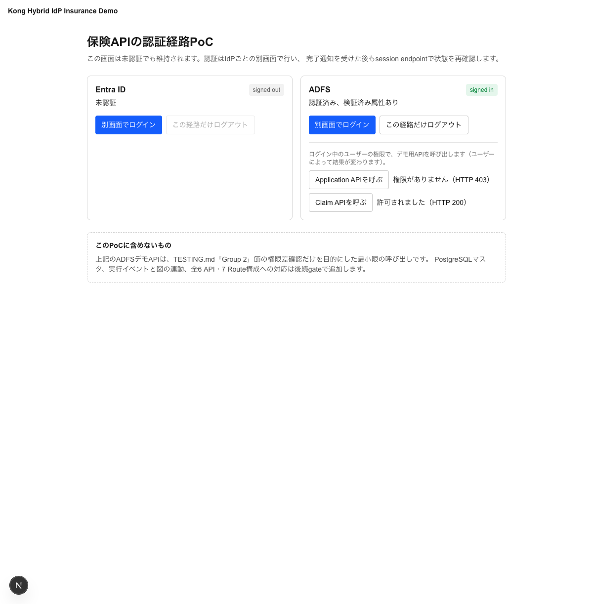
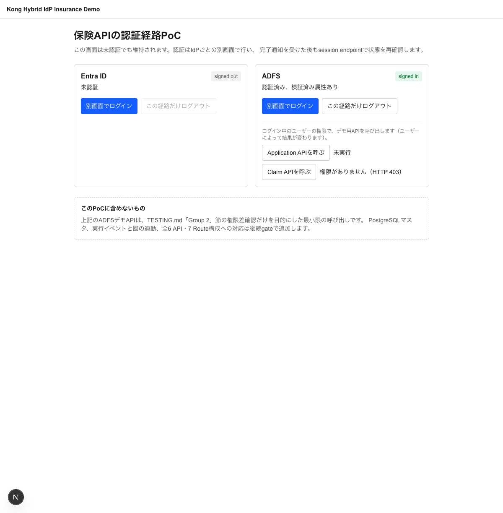

# 動作確認手順

[設計](docs/design-brief.md)に対応する既存Group 1回帰と、新しい保険API受入計画を記載します。セットアップ手順（`docker compose up` / `deck gateway sync`）は済んでいる前提です。未セットアップの場合は [README.md](./README.md) の「セットアップ手順」を先に行ってください。

> [!note]
> 2026-09-08: 本リポジトリはフォークだがPicketfence Labs内では新規Project扱いのため、`docs/decisions/`・`docs/troubleshooting-log.md`をリセットした（詳細はCLAUDE.md参照）。以下のGroup 1（Chat UI）のシナリオ・スクリーンショットはフォーク元での実機検証結果をそのまま引き継いでいる（機能に変更が無いため）が、本リポジトリでの実機再検証はまだ実施していない。Group 2の実装が一段落した段階で、Group 1・Group 2を通しで再検証する予定。

> [!warning] 2026-09-17: 回帰テストを一部実施、Entra IDテナント側の変更でシナリオ②③がブロック中
> シナリオ①（未割当ユーザーの`AADSTS50105`拒否）はGroup 2作業後も回帰なしを確認した（[13-entra-regression-scenario1-blocked.png](docs/testing-images/13-entra-regression-scenario1-blocked.png)）。一方シナリオ②③は、パスワード入力後にMicrosoft Authenticatorの必須MFA登録画面（[14-entra-regression-scenario2-mfa-enrollment-blocker.png](docs/testing-images/14-entra-regression-scenario2-mfa-enrollment-blocker.png)）で止まり、Chat UIへ到達できないため未実施。原因・対応は[troubleshooting-log](docs/troubleshooting-log.md)の2026-09-17エントリ参照。Entra ID管理者による対応（デモアカウントのMFA登録またはポリシー除外）待ち。

## Group 1: Chat UI（Entra ID OIDC/OBO）

### アクセス先

| 用途 | URL |
|---|---|
| Chat UI（ここからログインして操作します） | http://localhost:8000/ |
| Kong Admin API（decK同期状態の確認用、通常は使いません） | http://localhost:8001/ |

### テストユーザー

以下は既存デモの3ユーザー役割です。現在のアカウント状態と資格情報は管理者から安全に取得してください。本文に以前載っていたパスワードは除去しましたが、Git履歴からは消えていません。有効なら管理者が変更し、文書・画像・ログへ再掲しないでください。

| ユーザー | ログインID (UPN) | パスワード | 割り当てられた権限 |
|---|---|---|---|
| ① ログイン不可の反例 | `demo-no-agent-access@hashipicketfence.onmicrosoft.com` | `SECRET_FROM_SECURE_STORE` | なし（AIエージェントへのアクセス自体が未割当） |
| ② Inquiryのみ | `demo-inquiry-only@hashipicketfence.onmicrosoft.com` | `SECRET_FROM_SECURE_STORE` | 顧客検索（Customer Inquiry）のみ |
| ③ 両方 | `demo-both-apis@hashipicketfence.onmicrosoft.com` | `SECRET_FROM_SECURE_STORE` | 顧客検索＋顧客詳細（Customer Inquiry・Customer Details両方） |

複数ユーザーを行き来する場合、Entra IDのアカウント選択画面で「別のアカウントを使用する」を選ぶか、ブラウザのプライベートウィンドウを使うとスムーズです。

### テストデータの生成タイミングと構造

`services/demo-api/src/data.ts`のモジュールトップレベルで`generateCustomers(100, 42)`が**プロセス起動時に一度だけ**実行され、以降はメモリ上の配列を参照するだけ（リクエスト毎の再生成やDB永続化は無い）。固定シード（`42`）のmulberry32擬似乱数生成器のみから機械的に組み立てているため、プロセス/コンテナを再起動しても**毎回全く同じ100件（IDを含む）が再現**される。氏名は姓・名それぞれ10種の一般的な単語からの組み合わせ、マイナンバー相当値は12桁の乱数文字列（チェックデジット等の実仕様は再現していない）。実在の人物・実在の番号は一切参照していない完全な架空データ。

生成される1件のフィールド構成:

| フィールド | 型 | Inquiryで返す | Detailsで返す |
|---|---|---|---|
| `id` | UUID v4形式の文字列 | ✅ | ✅ |
| `name` | 姓+名 | ✅ | ✅ |
| `gender` | `"male"` \| `"female"` | ✅ | ✅ |
| `prefecture` | 47都道府県のいずれか | ✅ | ✅ |
| `age` | 20〜79の整数 | ✗ | ✅ |
| `myNumber` | 12桁の数字文字列（マイナンバー相当、チェックデジット等の実仕様は再現していない） | ✗ | ✅ |
| `address` | `{都道府県}〇〇市X丁目X番X号`（架空の地名） | ✗ | ✅ |
| `phone` | `090-XXXX-XXXX` | ✗ | ✅ |
| `email` | `customer{連番}@example.com` | ✗ | ✅ |

サンプル（`GET /customers/849d73eb-438a-407d-8904-02c802d7c570`相当）:
```json
{
  "id": "849d73eb-438a-407d-8904-02c802d7c570",
  "name": "小林花",
  "gender": "female",
  "prefecture": "島根県",
  "age": 30,
  "myNumber": "055262378522",
  "address": "島根県〇〇市3丁目1番6号",
  "phone": "090-6690-9491",
  "email": "customer0@example.com"
}
```

---

### シナリオ①: 未割当ユーザーはログインできないこと

1. http://localhost:8000/ を開く（未ログインなら自動的にEntra IDのログイン画面へ遷移します）

   

2. ユーザー①（`demo-no-agent-access@...`）のメールアドレス・パスワードを入力してサインインを試みる

   

3. **Entra ID自体が`AADSTS50105`エラーでログインを拒否**することを確認（Kongより手前、Entra IDの「割り当てが必要」設定による）

   

### シナリオ②: Inquiryのみユーザー（検索はできるが詳細取得はできない）

1. ユーザー②（`demo-inquiry-only@...`）でログイン（今度はEntra IDの認証を通過し、Chat UIへ遷移します）
2. 画面上部に「ログイン中: Demo User - Inquiry Only（demo-inquiry-only@...）」と表示されることを確認（Kongが転送したトークン情報がChat UIに反映されている証跡）
3. チャット欄に「**東京都在住の顧客を検索して**」と入力 → 顧客ID・氏名・性別・都道府県のサマリのみが返る
4. 続けて「**（表示された顧客名）さんの詳細情報を教えて**」と入力 → **拒否される**（`customer_details` Toolがこのユーザーには表示されず呼び出せないため）

   

### シナリオ③: 両方権限ユーザー（検索も詳細取得もできる）

1. ログアウトし、ユーザー③（`demo-both-apis@...`）でログイン
2. 画面上部の表示がユーザー③に変わることを確認
3. チャット欄に「**（同じ顧客名）さんの詳細情報を教えて**」と入力 → **今度は住所・電話番号・マイナンバー等のフル情報まで返る**

   

同じ質問でもログインユーザーによって回答内容（取得できる情報の範囲）が変わることが、AI MCP ProxyのACL（Entra IDのSecurity Groupベース）がOBO交換後のトークンに対して機能している証跡です。

---

### その他の確認項目（design-brief 5節、画面操作以外での確認）

上記シナリオで画面から確認できない残りの項目は、コードや通信ログから確認できます:

- **AND条件検索**: 「東京都在住の**女性**を検索して」のように条件を追加すると、該当者のみに絞り込まれること（性別を指定しなければ都道府県内の全員が返る点と比較すると分かりやすいです）
- **ログアウト**: 画面右上の「ログアウト」ボタン → Entra IDのサインアウト画面へ遷移 → 再度トップページへ戻ると未ログイン状態に戻っていること
- **顧客IDの推測不可**: Customer Details用の一覧・検索エンドポイントは存在しないため（[services/demo-api/src/server.ts](./services/demo-api/src/server.ts)参照）、Customer Inquiryを経由せずに顧客IDを得る手段が無いこと
- **エージェントのAzure非依存**: `services/chat-ui/src/app/api/chat/route.ts`がAzure OpenAIのエンドポイント・APIバージョン・デプロイ名を一切保持せず、固定のモデル名`kong-demo-llm`のみでKongの`/llm`エンドポイントを呼び出していること

---

## Group 2: Insurance UI（ADFS、現行構成）

> [!note] このセクションが対象とする構成
> ここで確認するのは、`kong/insurance-*.yaml`に現在デプロイ済みの**旧ADFS専用構成**（`/product`・`/application`・`/simulation`・`/policy`・`/claim`・`/customer`の6つの無接頭辞Routeを、いずれもADFSのbearerトークン単体＋`legacy-authz-adapter`の`allowed_groups`で保護する構成）です。下の「共通保険API」節にあるEntra 4入口／ADFS 3入口・計7 Routeの新設計（P4）とは対象が異なります。この節の結果を下の受入計画のケースIDへ転記しないでください。

### アクセス先

| 用途 | URL |
|---|---|
| Insurance UI（ここからADFSでログインします） | http://localhost:8000/insurance |
| Kong Admin API（decK同期状態の確認用、通常は使いません） | http://localhost:8001/ |

### テストユーザー

以下は自己管理AD DSフォレスト（`adfsdemo.picketfencelabs.local`）上の5デモユーザーです。パスワードはTerraform管理値（`terraform output -json insurance_test_user_credentials`）から取得してください。本文書・PR・コミットにパスワードを記載しないこと。手順は[docs/adfs-manual-test-script.local.md](docs/adfs-manual-test-script.local.md)（コミット対象外）を参照してください。

| ユーザー | ログインID (UPN) | department属性 | 確定するグループ |
|---|---|---|---|
| ① IT | `demo-it@adfsdemo.picketfencelabs.local` | `D-IT` | `it` |
| ② 営業 | `demo-sales@adfsdemo.picketfencelabs.local` | `D-SALES` | `sales` |
| ③ 新規事業 | `demo-new-business@adfsdemo.picketfencelabs.local` | `D-NEW-BUSINESS` | `new-business` |
| ④ 契約管理 | `demo-policy-admin@adfsdemo.picketfencelabs.local` | `D-POLICY-ADMIN` | `policy-admin` |
| ⑤ 保険金請求 | `demo-claim@adfsdemo.picketfencelabs.local` | `D-CLAIM` | `claim` |

### ユーザー×APIの権限一覧（期待値、`kong/insurance-*.yaml`の`allowed_groups`実値）

| ユーザー\API | product | application | claim | policy | simulation | customer |
|---|---|---|---|---|---|---|
| it | ○ | ○ | ○ | ○ | ○ | ○ |
| sales | ○ | ○ | ✕ | ○ | ○ | ○ |
| new-business | ○ | ○ | ✕ | ○ | ○ | ○ |
| policy-admin | ○ | ✕ | ○ | ○ | ✕ | ○ |
| claim | ✕ | ✕ | ○ | ○ | ✕ | ○ |

○=許可（200） ✕=拒否（403）。ブラウザから直接権限差を確認できるのは、insurance-uiに追加した2つのデモボタン（Application API・Claim API、いずれもADFSセッションをそのまま使い`legacy-authz-adapter`のbearer用Routeと同じ`allowed_groups`で判定する。他4 APIはUIから未配線）。

### シナリオ: 複数ユーザー・複数APIでの権限差の確認（実施済み）

上表からsales/policy-admin/it/new-businessの4ユーザーを選び、期待される結果が異なる6ケースをinsurance-uiのボタン操作のみで確認した（2026-09-17実施、`main` `aa3fcd5`+この変更、Playwright（Chromium）で実施）。

| ユーザー | 呼んだAPI | 期待 | 実際の表示 | 証跡 | 結果 |
|---|---|---|---|---|---|
| sales | Application API | 許可(200) | 許可されました（HTTP 200） |  | pass |
| sales | Claim API | 拒否(403) | 権限がありません（HTTP 403） |  | pass |
| policy-admin | Application API | 拒否(403) | 権限がありません（HTTP 403） |  | pass |
| policy-admin | Claim API | 許可(200) | 許可されました（HTTP 200） |  | pass |
| it | Application API | 許可(200) | 許可されました（HTTP 200） |  | pass |
| new-business | Claim API | 拒否(403) | 権限がありません（HTTP 403） |  | pass |

6/6 pass。同じユーザーが同じ操作でAPIによって許可/拒否が変わること（sales・policy-adminは2ケースずつ）、ユーザーが違えば同じAPIでも結果が変わること（Application APIはsales/it許可・policy-admin拒否、Claim APIはpolicy-admin許可・sales/new-business拒否）の両方を確認できている。

各ログインは`demo-claim`でのADFSログイン成功（前回セッション確認済み、「ADFS: signed in, 検証済み属性あり」表示）と合わせ、5ユーザー中4ユーザーのログイン成功実績も兼ねる。

> [!note] 複数ユーザーを1ブラウザで切り替える場合の既知の注意点
> アプリの「この経路だけログアウト」だけではADFS自身のSSOセッションが残り、次のユーザーでの「別画面でログイン」がサイレントに失敗して401になることがある（[docs/troubleshooting-log.md](docs/troubleshooting-log.md)の2026-09-17エントリ参照）。ユーザーを切り替える前に`https://adfs.adfsdemo.picketfencelabs.local/adfs/oauth2/logout`へアクセスしてADFS側のSSOセッションも明示的に破棄すること。

---

## 共通保険API: Entra系・ADFS系の受入計画

> [!warning] 新要件の受入計画。全ケース未実施
> 旧ADFS専用UI・全6 API配線は現行コードとして存在しますが、この計画には未対応です。図のpassや旧単体テストを以下の合格に転記しないでください。先に[開発再開手順](docs/development-handoff.md)と[設計本文](docs/design-brief.md)を確認します。

### 前提とfixture

- 図版PR、設計PRを利用者がレビュー・mergeし、ADR-0003のPoC gateを確認する。
- 実行commit、Gateway image digest、依存版、IdP/DB/Route設定の版を記録する。秘密値は記録しない。
- テストユーザーはEntra側5論理ロール、ADFS側5業務グループに対応する架空アカウントを用意する。資格情報は管理者から安全に取得し、文書・画像・PRへ記載しない。
- [初期実装fixture](docs/design-fixtures/insurance-permissions.json)はP0で採用した設計表の機械可読版。稼働DBの状態や成功済みtest結果ではない。実装時のseedとの対応を検査する。
- APIの実operation・fixtureを確認し、変更系の副作用が起きない読取りGETを使う。UIから任意URLを入力させない。

### 証拠の書式

各ケースに`case_id / git_commit / image_digest / environment / steps / expected / actual / evidence / status`を残す。statusは未実施、pass、fail、blocked。認証・認可・Upstream到達の3列を分け、raw token/code/cookieを隠す。Headerを手で注入したUI単体試験は本物のIdP E2Eとして扱わない。

### G1: 共通UIと認証セッション

| ID | 操作 | 期待する結果 |
|---|---|---|
| UI-01 | 未認証で`/insurance/`を開く | 図とAPI操作が見える。自動でIdPへ遷移せず、属性/過去の他人のrunは見えない |
| UI-02 | Entra対象を選びログイン | 別画面でEntraへ。元の図を維持。callback/token検証後にAPI操作可能 |
| UI-03 | ADFS対象を選びログイン | 別画面でADFSへ。Entraへfallbackしない |
| UI-04 | 両IdPで順にログイン | 2つの状態が独立し、既存Chatのセッションも壊れない |
| UI-05 | 有効セッションで同じAPIを呼ぶ | IdPへ再遷移したように表示しない |
| UI-06 | popup拒否/別画面終了/opener切断 | 再開リンクまたは待機/unknown。図を消さず成功を捏造しない |
| UI-07 | IdP内で拒否されcallbackへ戻らない | そのIdP標準画面にエラー。元UIは待機/未確認 |
| UI-08 | 不正state/nonce/再使用code、誤callbackを試す | セッション確立しない。codeはログ/画面/履歴に残さない |
| UI-09 | ADFSだけlogout | ADFS Cookieを無効化。Entraと既存Chatは維持。IdP全体SSO logoutと区別 |
| UI-10 | 不正token/期限切れ/issuer・audience不一致 | APIは拒否。XHRをIdP HTMLへ転送しない。refresh/reloginは観測結果に応じ表示 |

### API経路とPath分離

| ID | 操作 | 期待する結果 |
|---|---|---|
| ROUTE-01 | fixtureの7入口を確認 | Entra4・ADFS3だけが存在。6 backendに対応 |
| ROUTE-02 | `/entra/customer`と`/adfs/customer`の同じfixture IDを読む | 認証経路は異なり、同じinsurance-customerへ到達 |
| ROUTE-03 | 旧無接頭辞Path、`/adfs/product`、`/entra/policy`等を要求 | 対象外は404等で未ルーティング。別IdPへのfallbackや保護なし経路なし |
| ROUTE-04 | `/customer-evil`、encoded separator、二重prefix、未知suffix | 誤マッチ・traversal・意図しないrewriteなし |
| ROUTE-05 | 顧客ID suffixとqueryを付ける | Upstream `/customers/ITEM_ID`等へ1回だけ変換。query保持 |
| ROUTE-06 | Entra token/CookieをADFS経路へ、逆方向も試す | 経路間の資格情報流用を拒否 |
| ROUTE-07 | 初期許可外のPOST/PUT/DELETEを試す | UIにボタンなし。直呼びでも認可されず副作用なし |

### 認可表を全セルで検証する

表の正本は[設計本文](docs/design-brief.md)と対応する初期実装fixture。ここに別の許可表を手書きしない。

- **AUTH-E-01〜20**: Entraの5ロール×4 API。設計fixtureの **15 allow/5 deny** に従う。
- **AUTH-A-01〜15**: ADFSの5グループ×3 API。**13 allow/2 deny**。
- **AUTH-E-EXTRA**: 許可Groupなし、未知Group、複数Group（OR条件案）、groups欠落/overageを試す。完全な属性がない時に許可へ倒さない。
- 各allowは「照合に使った実属性」「一致条件」「認可allow」「Upstream受信」を記録する。
- 各denyは「認証成功」「認可deny」「前段停止の証拠」を記録する。単にUIへ403が見えたことだけで停止担当を断定しない。

### G2/G3: 検証済み属性とPostgreSQL

| ID | 操作 | 期待する結果 |
|---|---|---|
| DB-01 | 各架空属性を持つ実IdPユーザーで認証 | 5 mappingと13許可行に従う。属性値とgroup_idが異なっていても正しく解決 |
| DB-02 | 属性欠落/空/複数値/未知値/過大入力 | 明示した属性要件で拒否。既定グループを割り当てない |
| DB-03 | callerからclaim/業務グループ/結果Headerを偽造 | 実際の検証済み属性・結果以外を採用しない。case/重複Headerも試す |
| DB-04 | 許可行だけをseed transactionで変更 | decK側のallowed_groups変更なしで結果が変わる。revision/一致ruleが表示される |
| DB-05 | SQL特殊文字を含む属性・未知API/method | SQL注入やcaller指定api_idでの許可拡大なし |
| DB-06 | DB停止、timeout、schema不整合、接続権限失敗 | 503等の認可基盤障害。403の権限不足と区別し、Upstream未転送 |
| DB-07 | 繰返し/並行要求、seed更新中の照会 | 接続解放、pool上限、timeout、同一snapshotが成立。半更新ルールで判定しない |
| DB-08 | PluginユーザーでINSERT/UPDATE/DDLを試す | DBが拒否。必要SELECTだけ可能 |

### G4: Header・観測・図

| ID | 操作 | 期待する結果 |
|---|---|---|
| OBS-01 | allow/denyを実行 | 正しいUI/Route/IdP/DB/APIのIDへ状態が対応。図の操作でAPIを再実行しない |
| OBS-02 | OIDCが認証/標準認可で早期拒否 | 後段access処理が動かなくても観測可能、またはunknownと明示。偽の成功なし |
| OBS-03 | 許可後のUpstream 500/接続拒否/timeout | authz allowとBackend障害を分離。証跡なしの到達はunknown |
| OBS-04 | HeaderをUpstream側でも偽造する | Gateway結果と混同せず、予約response Headerを上書き/除去 |
| OBS-05 | 別run、遅延、重複、順不同イベントを送る | 別runの表示を上書きしない。証拠順序がない時に因果関係を創作しない |
| OBS-06 | 他利用者/未認証でrunを取得、ブラウザからイベント書込み | 拒否。run IDだけで属性や履歴を取得・偽造できない |
| OBS-07 | collector停止/再起動/保持期限切れ | 認可は変更しない。欠落/履歴消失をunknownとして表示 |
| OBS-08 | popup通知を偽造、origin/sourceを変更 | 通知だけで認証済みにしない。再検証が必要 |
| OBS-09 | 図を再生成し素材hash/IDが変わる | adapter対応を検査し不整合を検出。Pagesへ実属性を送らない |
| OBS-10 | 公開図・DOM・ログ・画像・履歴を点検 | token/code/cookie/secret/不要な個人属性なし |

### 実基盤と回帰

- INFRA-01: Entra DS同期とADFS claimを実token種別ごとに確認。Headerの見かけで代用しない。
- INFRA-02: ブラウザとKongコンテナの両方からFQDN/TLS/discovery/JWKS/token endpoint到達を確認。NSG許可外からは拒否。
- REG-01: 前半の既存Chatログイン拒否、Inquiryのみ、両Tool、logout、OBO、LLMの回帰を全て実施。今回の実測をfork元画像と分ける。
- CLEANUP-01: 承認後の削除結果をAzure残存一覧とTerraform managed resourceで確認。data sourceが残ることとリソース残存は同義ではない。

全セルやgateに失敗/blockedが残ればE2E完了にしない。資格情報が未変更の公開済みアカウントを使う前に、管理者へ変更確認を求める。

## 知見の記録

設計判断は[ADR](docs/decisions/)、想定外と実測は[troubleshooting-log](docs/troubleshooting-log.md)へ記録する。
