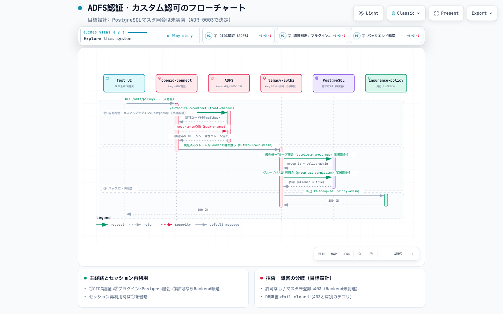

# Group 2解説: ADFS OIDC認証とカスタムプラグイン認可（legacy-authz-adapter）

[OBO.md](./OBO.md)がGroup 1（Entra ID直結・OIDC OBO）の解説であるのに対し、本書はGroup 2（ADFSグループ）側の解説です。設計判断の背景は[design-brief.md](./design-brief.md)を、実装時に判明した挙動は[troubleshooting-log.md](./troubleshooting-log.md)を参照してください。

> [!note] 現状と目標設計を区別して読んでください
> 本書は「実際に動いている現状の実装」と「ADR-0002で要件としては確定しているが、実装方式の提案（ADR-0003）がまだ「提案中」でPoC未実施・実装自体も未着手の目標設計（PostgreSQLマスタ）」の両方を扱います。混同を避けるため、各節・下図のsubtitle/sublabelで明示しています。実際にテストした結果は[TESTING.md](../TESTING.md)の「Group 2: Insurance UI（ADFS、現行構成）」節を参照してください。

## 1. 全体像

Group 2はEntra IDからフェデレーションしたADFSに対し`openid-connect`プラグインで通常の認可コードフローを行い（OBOなし）、その後段でカスタムLuaプラグイン`legacy-authz-adapter`（`kong/plugins/legacy-authz-adapter/`）がIDトークンのクレームからグループを確定し、API（Service）ごとのアクセス可否を判定します。

*画像クリックでインタラクティブ版（パン/ズーム・テーマ切替・ステップ再生）を開く（[picketfence-labs/diagrams](https://github.com/picketfence-labs/diagrams)、GitHub Pagesで配信。[Archify](https://github.com/tt-a1i/archify)で生成したsequence図）。既存の目標構成図（[design-brief.md](./design-brief.md)冒頭）がGroup 2をカスタム認可1箱に集約しているのに対し、この図はGroup 2内部だけを6 participant・13メッセージで詳細化したものです。図のタイトル下「目標設計: PostgreSQLマスタ照会は未実装（ADR-0003で決定）」の通り、`legacy-authz-adapter`のPostgreSQL照会部分（`legacy-authz-adapter`ノード以降の`authz-db`照会）はまだ実装しておらず、実際は次節の通りKong宣言的設定（`known_groups`/`allowed_groups`）で判定しています。*

図の3フェーズ:
1. **①OIDC認証（ADFS）**: ブラウザ→`openid-connect`→ADFSの認可コードフロー（front-channel redirect→callback→code-token交換のback-channel→検証済みIDトークン）。**ここまでは現状実装そのもの**
2. **②認可判定**: `openid-connect`が検証済みクレームをヘッダー（`X-ADFS-Group-Claim`）で引き渡した後、属性値→グループ照会・グループ×API許可照会の2段でPostgreSQLへ問い合わせる想定。**目標設計であり未実装**。現状は同じ入力（ヘッダー値）を`legacy-authz-adapter`がKongの宣言的設定（`known_groups`/`allowed_groups`）とその場で照合するだけで、DBは一切関与しません
3. **③バックエンド転送**: 許可されたグループIDを`X-Group-Id`ヘッダーでバックエンド（図の例では`insurance-policy`）へ転送。**現状実装そのもの**

## 2. OIDC認証: `openid-connect` × ADFS

[design-brief.md](./design-brief.md)のGroup 2冒頭「方針転換の経緯」の通り、当初検討していたSAML方式は公式`saml`プラグインがSAMLアサーションの属性を一切パースできないと判明したため撤回し、ADFSのOIDC/OAuth2エンドポイント（`/adfs/.well-known/openid-configuration`）に対する通常の認可コードフローへ切り替えました。OBOは行いません。

`kong/insurance-*.yaml`（6 Service）・`kong/insurance-ui-route.yaml`（ADFS側の別画面ログイン）が、この`openid-connect`設定を持ちます:

- `issuer`: ADFSのdiscoveryエンドポイント（`DECK_ADFS_ISSUER`）
- `issuers_allowed`: discoveryのissuerに加え、ADFSがaccess tokenのiss claimに発行するWS-Trust由来のレガシー値も許容（実機で判明した挙動。詳細は[troubleshooting-log.md](./troubleshooting-log.md)参照）
- `client_id`/`client_secret`: ADFSのApplication Group（Server application、confidential client）の値
- `auth_methods`: バックエンドAPI用Routeは`bearer`、insurance-uiの別画面ログイン用Routeは`session`（認可コードフロー＋セッションCookie）
- `upstream_headers`: 検証済みIDトークンの属性値クレーム（`DECK_ADFS_GROUP_CLAIM_NAME`で指定した名前、既定は`department`相当の値）を`X-ADFS-Group-Claim`ヘッダーへコピー

insurance-uiの2つのADFSデモAPI用Route（`/adfs/call/application`・`/adfs/call/claim`）は、この`session`認証を流用し、ブラウザの既存ADFSセッションCookie（`insurance_adfs_session`、`session_cookie_path: /adfs`）だけで動作します。別途bearerトークンを取得する操作をUIに追加していません（[TESTING.md](../TESTING.md)参照）。

## 3. カスタム認可プラグイン: `legacy-authz-adapter`（現状実装）

`openid-connect`がIDトークンを検証した後の`access`フェーズで実行されます（`PRIORITY = 100`、`openid-connect`の既定優先度1000番台より低く設定し、ヘッダーが書き出された後に動くことを保証。[handler.lua:1-8](../kong/plugins/legacy-authz-adapter/handler.lua#L1-L8)）。

1. `conf.group_claim_header`（既定`X-ADFS-Group-Claim`）からクレーム値を読む（[handler.lua:11](../kong/plugins/legacy-authz-adapter/handler.lua#L11)）
2. `authz.determine_group`が値を`conf.known_groups`（既定5グループ: `it`/`sales`/`new-business`/`policy-admin`/`claim`）と照合し、未知の値・欠落を403で拒否する（[authz.lua:10-22](../kong/plugins/legacy-authz-adapter/authz.lua#L10-L22)）
3. `authz.is_allowed`が確定したグループIDを`conf.allowed_groups`（Service単位で個別設定）と照合し、含まれなければ403で拒否する（[authz.lua:25-32](../kong/plugins/legacy-authz-adapter/authz.lua#L25-L32)）
4. 許可されれば`conf.group_header_name`（既定`X-Group-Id`）にグループIDを設定し、ダウンストリームへ転送する（[handler.lua:26](../kong/plugins/legacy-authz-adapter/handler.lua#L26)）

### config

| フィールド | 型 | 既定値 | 説明 |
|---|---|---|---|
| `group_claim_header` | string | `X-ADFS-Group-Claim` | `openid-connect`がクレーム値をコピーしているヘッダー名 |
| `group_header_name` | string | `X-Group-Id` | 確定したグループIDをダウンストリームへ転送するヘッダー名 |
| `known_groups` | string[] | 5グループ | 有効なグループIDの一覧 |
| `allowed_groups` | string[] | （必須、既定なし） | このServiceへのアクセスを許可するグループID。Service毎にdecKで設定（[kong/insurance-application.yaml](../kong/insurance-application.yaml)等） |

`allowed_groups`の実値はServiceごとに異なり、design-briefのADFS系グループ⇔APIアクセスマトリクスに対応します（`product`はit/sales/new-business/policy-admin、`application`はit/sales/new-business、`claim`はit/policy-admin/claim、`policy`は全5グループ、`simulation`はit/sales/new-business、`customer`は全5グループ）。実際に権限差が出ることを確認した手順・スクリーンショットは[TESTING.md](../TESTING.md)を参照してください。

**認可の正本は現状Kongの宣言的設定そのもの**（`kong/insurance-*.yaml`の`allowed_groups`、decKでgit管理）であり、PostgreSQL等の外部DBは一切参照していません。単体テスト（`authz.lua`、Kongランタイム非依存）は[kong/plugins/legacy-authz-adapter/README.md](../kong/plugins/legacy-authz-adapter/README.md)の通り`luajit`のみで実行できます。

## 4. PostgreSQLマスタと業務データ構造（目標設計、未実装）

「Group 2のカスタム認可はPostgreSQLで属性対応とAPI許可条件を照会する」こと自体は[ADR-0002](decisions/0002-hybrid-idp-requirements.md)の確定要件ですが、具体的なテーブル設計・DB接続方式を提案する[ADR-0003](decisions/0003-ui-session-master-observation.md)は本稿執筆時点で**状態「提案中」**（G3/G4のPoC未実施、採否未確定）であり、**実装自体もまだ行っていません**。以下はdesign-brief.mdの「5. 認可表とPostgreSQLマスタ」を正本とする目標設計の要約です。

### 狙い

現状の`legacy-authz-adapter`は「属性値=グループID」を前提に、判定条件（`known_groups`/`allowed_groups`）をKongの宣言的設定（decK YAML）へ直接埋め込んでいます。これはこのデモの初期実装として意図的に簡略化したものですが、実在のレガシー認可サービスは通常、属性→グループの対応表とグループ×API許可の対応表を外部のマスタデータとして持ち、Kong（Gatewayの設定）とは独立して更新できるようにします。目標設計はこの構造をPostgreSQLで再現し、**認可の正本をKongの宣言的設定からDBへ移す**ことを狙いとしています。

### テーブル案

| テーブル案 | 主な列・制約 | 役割 |
|---|---|---|
| `attribute_group_map` | `attribute_value`主キー、`group_id`必須 | ADFSが発行する属性値（例: `D-SALES`）を業務グループID（例: `sales`）へ変換する対応表。入力属性名はPlugin設定で1つに固定 |
| `api_permission` | `group_id, api_id, http_method`の複合主キー、`rule_id`一意 | グループ×API×HTTPメソッドごとの許可行。初期は明示的なGET許可行のみを想定 |
| `master_revision` | seed版を示す1行 | 判定に使ったマスタのバージョンを、判定結果と同じDBスナップショットから読む |

`api_id`はRoute/Plugin設定側で固定し、呼び出し元のHeader/queryで上書きできないようにする想定です。HTTPメソッドは実リクエストから取得します。

### 処理の概要（目標設計）

1. `openid-connect`が検証したクレーム（現状と同じ`X-ADFS-Group-Claim`相当）を取得する
2. `attribute_group_map`を照会し、属性値→業務グループIDへ変換する（現状の`authz.determine_group`が`known_groups`との静的照合で代替している部分）
3. `api_permission`を照会し、`(group_id, api_id, http_method)`の許可行があるか判定する（現状の`authz.is_allowed`が`allowed_groups`配列との静的照合で代替している部分）
4. 許可されればグループIDをヘッダーで転送し、拒否ならAPI/内部結果を403（`permission_missing`）等で返す

1回のJOIN照会または同一スナップショットの読み取りで、mapping・許可行・revisionをまとめて取得し、複数グループの扱い・deny優先・キャッシュ・リトライ・汎用ルールエンジンは初期実装に含めない方針です。SQLは文字列連結せず、ドライバーの安全な値バインド・nonblocking動作・timeout・pool・解放を実機で確認してから採用します（design-briefの用語でG3 PoC）。DBはKong内部テーブルと分離し、Pluginが使うDBユーザーは必要なSELECTのみに限定、migration/seedユーザーは別にする想定です。

### 判定結果の分類（目標設計）

| 結果 | 目安 | 現状実装との対応 |
|---|---|---|
| token無効/未認証 | 401 | `openid-connect`が現状も同様に401を返す（変更なし） |
| 必要属性欠落・不正 | 403 / `invalid_attribute` | 現状は`authz.determine_group`の「クレーム値が空」ケースに相当（403のみ、reasonコードは未実装） |
| mappingなし | 403 / `attribute_unmapped` | 現状は`authz.determine_group`の「未知のクレーム値」ケースに相当 |
| 対象API/操作の許可行なし | 403 / `permission_missing` | 現状の`authz.is_allowed`が`false`を返すケースに相当（reasonコードは未実装、応答は`{"message": "access denied"}`で統一） |
| DB接続/timeout/schema障害 | 503 / `authorization_unavailable` | 現状はDBを参照しないため該当する障害モード自体が存在しない |

現状の`legacy-authz-adapter`は上表の「403系の理由」を区別せず、いずれも`kong.response.exit(403, { message = "access denied" })`で応答します（[handler.lua](../kong/plugins/legacy-authz-adapter/handler.lua)）。理由コードの区別・DB障害時のfail closed・観測用ヘッダー（`X-Demo-Authz-Result`等）はPostgreSQL化とあわせて実装する想定です。

## 関連ドキュメント
- [OBO.md](./OBO.md) — Group 1（Entra ID OBO）の解説。本書と対になるドキュメント
- [design-brief.md](./design-brief.md) — 要件・アーキテクチャの正本（「5. 認可表とPostgreSQLマスタ」が本書4節の元）
- [decisions/0002-hybrid-idp-requirements.md](decisions/0002-hybrid-idp-requirements.md) — PostgreSQLマスタ化を含む確定要件（ADR-0002）
- [decisions/0003-ui-session-master-observation.md](decisions/0003-ui-session-master-observation.md) — テーブル設計・DB接続方式の提案（ADR-0003、状態は「提案中」）
- [kong/plugins/legacy-authz-adapter/README.md](../kong/plugins/legacy-authz-adapter/README.md) — プラグイン単体のconfig仕様・単体テスト手順
- [troubleshooting-log.md](./troubleshooting-log.md) — 実機検証で判明した挙動の詳細
- [TESTING.md](../TESTING.md) — 実際にADFSでログインし、ユーザーによってAPIの許可/拒否が変わることを確認する手順
